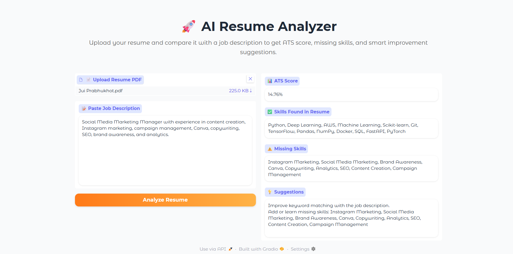
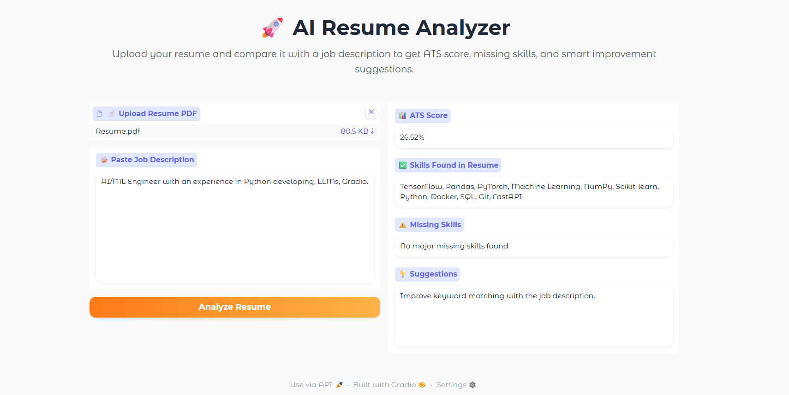

# 🚀 AI Resume Analyzer

An AI-powered Resume Analyzer that evaluates resumes against job descriptions, calculates ATS compatibility scores, identifies missing skills, and provides personalized recommendations to improve job-fit.

---

## 📌 Overview

AI Resume Analyzer helps job seekers understand how well their resumes match a target role before applying.

The system extracts resume content from PDF files, compares it with a job description, calculates an ATS score, identifies missing skills, and generates actionable suggestions to improve the resume.

---

## ✨ Features

### 📄 Resume Parsing

* Upload Resume PDF
* Automatic text extraction

### 📊 ATS Score Analysis

* Calculates resume-job compatibility
* Evaluates keyword alignment

### 🔍 Skill Extraction

* Identifies technical skills
* Matches skills against job requirements

### ⚠️ Missing Skills Detection

* Highlights important skills missing from the resume

### 💡 Smart Recommendations

* Resume improvement suggestions
* Better ATS optimization guidance

### 🎨 Interactive Dashboard

* User-friendly Gradio interface
* Fast and responsive analysis

---

## 📸 Project Screenshots


### ATS Score Evaluation 1



### ATS Score Evaluation 2



---

## 🏗️ System Workflow

```text
Resume PDF
     ↓
PDF Text Extraction
     ↓
Skill Extraction
     ↓
Job Description Analysis
     ↓
ATS Score Calculation
     ↓
Missing Skills Detection
     ↓
Improvement Suggestions
     ↓
Final Report
```

---

## 🛠️ Tech Stack

### Frontend

* Gradio

### Backend

* Python

### Machine Learning & NLP

* Scikit-Learn
* NLP Techniques

### Document Processing

* PDFPlumber

### Development Tools

* Git
* GitHub

---

## 📂 Project Structure

```text
AI-Resume-Analyzer/
│
├── app/
│   └── app.py
│
├── src/
│   ├── resume_parser.py
│   ├── skill_extractor.py
│   ├── ats_score.py
│
├── docs/
│   └── screenshots/
│
├── requirements.txt
├── README.md
└── .gitignore
```


---

## 🎯 Use Cases

* Resume Optimization
* ATS Compatibility Testing
* Career Preparation
* Internship Applications
* Job Search Assistance

---

## 🔮 Future Enhancements

* AI Resume Rewriter
* Resume Ranking System
* Multiple Resume Comparison
* LinkedIn Profile Analysis
* AI Interview Preparation
* PDF ATS Reports
* LLM-Powered Career Suggestions

---

## 👩‍💻 Author

**Jui Prabhukhot**

AI/ML Enthusiast | Python Developer | Aspiring Machine Learning Engineer

---

## ⭐ Support

If you found this project useful, consider giving it a star on GitHub.
